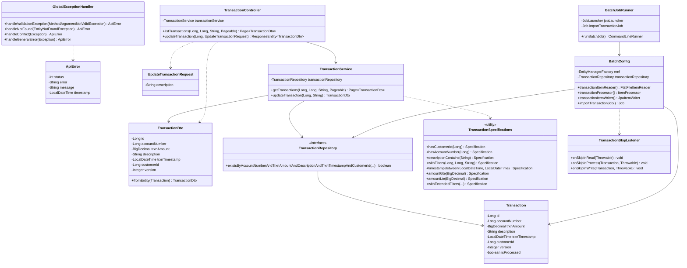
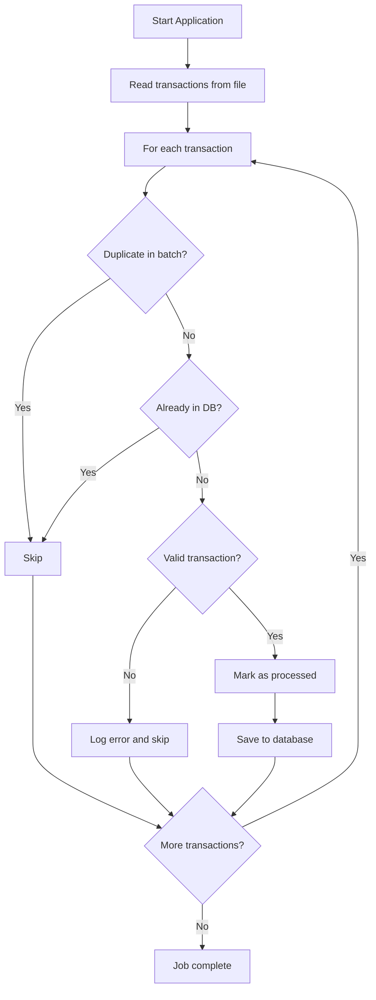

# Maybank Assessment Project

A Spring Boot application that demonstrates batch processing and RESTful API development with advanced features such as dynamic filtering, pagination, and optimistic locking for concurrent updates.

## Project Overview

This application implements:
1. A batch job that processes transaction data from a text file
2. RESTful APIs for retrieving and updating transaction records
3. Advanced search capabilities with dynamic filtering
4. Concurrent update handling with optimistic locking
5. Unit tests for core functionality

## Technology Stack

- **Framework**: Spring Boot 3.x
- **Database**: MySQL 8.0
- **Build Tool**: Maven
- **Libraries**: 
  - Spring Data JPA
  - Spring Batch
  - Lombok
  - Spring Web
  - Spring Validation

## Getting Started

### Prerequisites

- Java 17 or higher
- Docker (for running the MySQL database)
- Maven

### Database Setup

Run the following Docker command to start MySQL:

```bash
docker run --name maybank-mysql -p 3307:3306 -e MYSQL_ROOT_PASSWORD=root -e MYSQL_DATABASE=maybankdb -e MYSQL_USER=maybank -e MYSQL_PASSWORD=maybank123 -d mysql:8 -v mysql_data:/var/lib/mysql
```

To access the MySQL command line:

```bash
docker exec -it maybank-mysql mysql -u maybank -pmaybank123 maybankdb
```

### Running the Application

1. Clone the repository:
```bash
git clone https://github.com/yourusername/maybank-assessment.git
cd maybank-assessment
```

2. Build the project:
```bash
mvn clean package
```

3. Run the application:
```bash
java -jar target/maybank-assessment-0.0.1-SNAPSHOT.jar
```

## Architecture and Design Patterns

### Design Patterns Used

1. **Repository Pattern**
   - Abstracts the data layer, providing a collection-like interface for domain objects
   - Classes: `TransactionRepository`

2. **Builder Pattern**
   - Used via Lombok annotations (`@Builder`) for creating complex objects
   - Applied to DTOs and entities like `Transaction` and `TransactionDto`

3. **DTO (Data Transfer Object) Pattern**
   - Separates the API contract from internal domain models
   - Classes: `TransactionDto`, `UpdateTransactionRequest`

4. **Specification Pattern**
   - Enables dynamic query construction based on filters
   - Class: `TransactionSpecifications` with methods for composing query criteria

5. **Strategy Pattern**
   - Used in batch processing for different phases (read, process, write)
   - Implemented through Spring Batch's ItemReader, ItemProcessor, ItemWriter

6. **Factory Pattern**
   - Spring's BeanFactory creates and configures objects

7. **Optimistic Locking**
   - Handles concurrent updates to prevent data inconsistencies
   - Implemented via JPA's `@Version` annotation on Transaction entity

## Class Diagram



## Activity Diagrams

### Batch Processing Flow



### Transaction Retrieval API Flow


### Transaction Update API Flow


## API Documentation

### Endpoints

#### Get Transactions
```
GET /transactions?customerId={id}&accountNumber={number}&description={text}&page={page}&size={size}
```

**Parameters:**
- `customerId` (optional): Filter by customer ID
- `accountNumber` (optional): Filter by account number
- `description` (optional): Filter by description (case-insensitive, partial match)
- `page` (optional): Page number (default: 0)
- `size` (optional): Page size (default: 20)

**Response:**
```json
{
  "content": [
    {
      "id": 1,
      "accountNumber": 8872838283,
      "trxnAmount": 123.00,
      "description": "FUND TRANSFER",
      "trxnTimestamp": "2019-09-12T11:11:11",
      "customerId": 222,
      "version": 0
    }
  ],
  "pageable": {...},
  "totalElements": 46,
  "totalPages": 3,
  "last": false,
  "size": 20,
  "number": 0,
  "sort": {...},
  "numberOfElements": 20,
  "first": true,
  "empty": false
}
```

#### Update Transaction
```
PUT /transactions/{id}
```

**Request Body:**
```json
{
  "description": "Updated description"
}
```

**Response:**
```json
{
  "id": 1,
  "accountNumber": 8872838283,
  "trxnAmount": 123.00,
  "description": "Updated description",
  "trxnTimestamp": "2019-09-12T11:11:11",
  "customerId": 222,
  "version": 1
}
```

## Concurrency Handling

This application uses optimistic locking to handle concurrent updates. The `@Version` field in the Transaction entity is automatically incremented on each update. If two users try to update the same transaction simultaneously, the second update will fail with a 409 Conflict response, indicating that the data has been modified since it was last read.

## Error Handling

The application provides detailed error responses through the `GlobalExceptionHandler` class:
- 400 Bad Request: Validation errors
- 404 Not Found: Resource not found
- 409 Conflict: Concurrent update conflicts
- 500 Internal Server Error: Unexpected errors

## Batch Processing Features

The batch job:
1. Uses a pipe-delimited file format for transaction data
2. Performs both in-memory and database-level deduplication
3. Validates transaction data (e.g., positive amount validation)
4. Uses a skip listener to log errors without failing the entire batch
5. Processes transactions in configurable chunk sizes (currently 50)

## Future Enhancements

1. Add authentication and authorization
2. Implement more sophisticated search filters
3. Add transaction statistics endpoints
4. Support for multiple file formats in batch processing
5. Add actuator endpoints for monitoring
